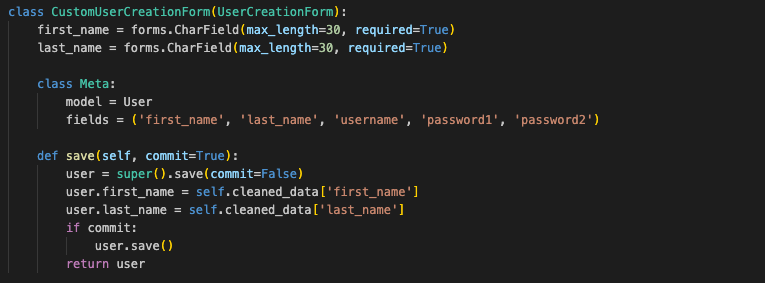
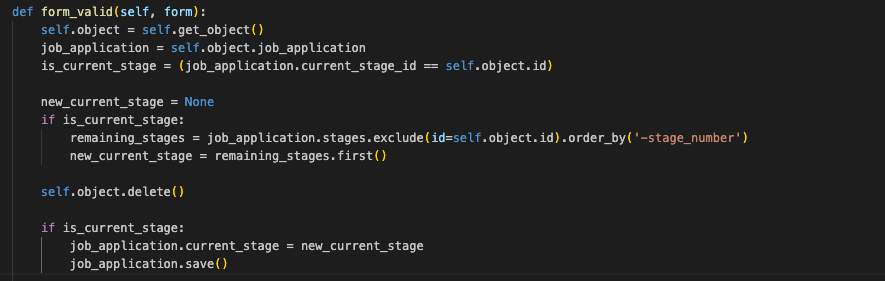
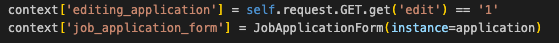
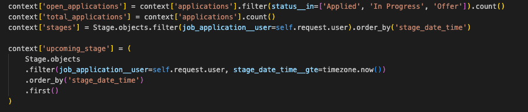

# Job Logger

## Description

This is my fourth developer project, using Python and SQL for the first time. It is a job application tracking website, where users can document their application, create stages to track progression and make notes to refer back to. An intense job search can take you to many different sites, and applicants can easily lose track of their progression. This site provides a user friendly solution for users to stay in control of their search.

## Deployed Link
Deployed Link [Job Logger](https://job-logger.onrender.com)

[Job Logger](https://job-logger.onrender.com/)

## Getting Started/Code Installation

1. Clone Git repository: git clone https://github.com/jamiekaye9/job-logger
2. Navigate into the job-logger folder
3. Run 'pipenv install django' in your terminal to initialise a new virtual environment.
4. Activate the environment using 'pipenv shell'
6. Run 'python3 manage.py runserver'

## Timeframe & Working Team

This was a solo project, built in the timeframe of 1 week.

## Technologies Used

Python, HTML, CSS, Django, PostgreSQL.

## Brief

- Build a Django application with full CRUD functionality.
- Use PostgreSQL as the database management system.
- Use Django's built-in session-based authentication.
- Guest users should not be able to perform CRUD operations.
- The app should have at least one data entity in addition to the User model.
- At least one entity must have a relationship with the User model.
- The app utilised CSS flexbox for page layout design.

## Planning

To plan this project, I created user stories, stretch goals, wireframes, and an ERD — all of which are available in the Trello link below. I also used Canva for the first time to design my wireframes, and found it to be a useful tool that I’ll definitely use again in future projects.

[Planning Documents](https://trello.com/invite/b/68377a281c77a3e18261e778/ATTIc80ca4962ea260745aa7c8c59eceea5d877CEE88/job-logger)

## Build/Code Process

To start this project, I used Django’s built-in User model. I really appreciated how Django handles user accounts and authentication out of the box, it saved a lot of setup time. However, I wanted to collect a few extra details during registration, specifically the user’s first and last names.

To achieve this, I created a Custom User Creation Form that extends Django’s default UserCreationForm. In this form:
  - I added first_name and last_name as required fields.
  - I specified that the form should include first_name, last_name, username, password1, and password2 so users provide all the necessary information.
  - I customized the save method so that after the form validates the input, it sets the user’s first_name and last_name before saving the user to the database.

This approach allowed me to keep Django’s reliable authentication system while adding just the extra details I needed.

While building my other models—specifically the JobApplication model, I added a current_stage field. This field helps display a user’s up-to-date progress in the UI, showing where they are in the application process.

However, I needed to make sure that if a stage marked as current_stage was ever deleted, the app would automatically replace it with the next most recent stage. To achieve this, I:
  - Checked if the stage being deleted was the current stage for the job application.
  - If it was, found the next most recent stage (by stage number) to replace it.
  - Deleted the stage from the database.
  - Updated and saved the job application's current_stage if a replacement was needed.

Although including extra data allowed me to improve and evolve the UI, it also introduced challenges in maintaining data quality. I found this to be a great example of the kind of issue that’s easy to overlook during development and often surfaces during a testing phase.

I wanted users to be able to edit a job application directly on the detail page, without needing to navigate to a separate edit page. In React, you might handle this easily using useState, but since the front end for this project is built with Django templates, I had to approach it differently. To achieve this:
  - I pass a JobApplicationForm (pre-filled with the existing data) into the template.
  - I checked for a query parameter (?edit=1) to control whether the page should display the form in edit mode.

This solution worked well for what I needed, but it also highlighted how some languages and frameworks are better suited for certain parts of a project. React, for example, makes this kind of interactive front-end functionality much easier to handle.

I was keen to add reporting functionality to the profile page, as this would set the application apart from users having to maintain their own tracking documents. To do this, I passed the following data to the template:
  - open_applications: A count of the user's applications that are still active, with statuses like "Applied", "In Progress", or "Offer".
  - total_applications: The total number of applications the user has submitted.
  - upcoming_stage: The next stage the user has scheduled, based on the soonest stage_date_time that is still in the future.

This created a clean, user-friendly profile view that highlights the most important details. It also helped me see how different languages and frameworks handle passing data to the front end. In Django, I passed this data through the view context, whereas in React I would have passed it down as props.

## Challenges/Takeaways

A major challenge in this project was building a dynamic front-end using Django templates. After using React in my previous project, I noticed the struggles associated with a single page application rather than loading individual components. My initial plan was (word for over achieveable) for Django templates and I ended up having to use a variety of solutions to meet my requirements. Although this was a challenge, it was a learning experience, and grew my knowledge of Django capabilities more than it would have done with simple requirements.

Another challenge I faced was working with Python syntax, which was new to me. I had to get familiar with concepts like CSRF tokens, Django’s built-in user model, class-based views, and the different folder structure. While learning the syntax took practice and repetition, I found that the key was understanding how everything fits together — how views connect to URLs, which then connect to templates, and so on. Focusing on the overall process rather than just the syntax has made me more confident in picking up new languages and frameworks in the future.

Finally, moving from an object-related database to a SQL database was a new experience. Writing queries directly in the terminal and searching for specific data points felt challenging at first. But through the course’s lab exercises, I was able to practice, work through examples, and build confidence. I now focus on understanding what the queries are doing, rather than just trying to memorise the syntax.

## Future Improvements

In the future, I plan to rebuild this application with a React front end and a Django back end. This will give me more flexibility to improve the UI and bring it closer to a production-ready site for public users. I also aim to learn and use Bootstrap to make the app responsive and work well across different screen sizes.

On the functionality side, I’d like to add more reporting features, including visual charts and graphs. This would help the app stand out from other options and also strengthen my skills in presenting data in clear and engaging ways.
